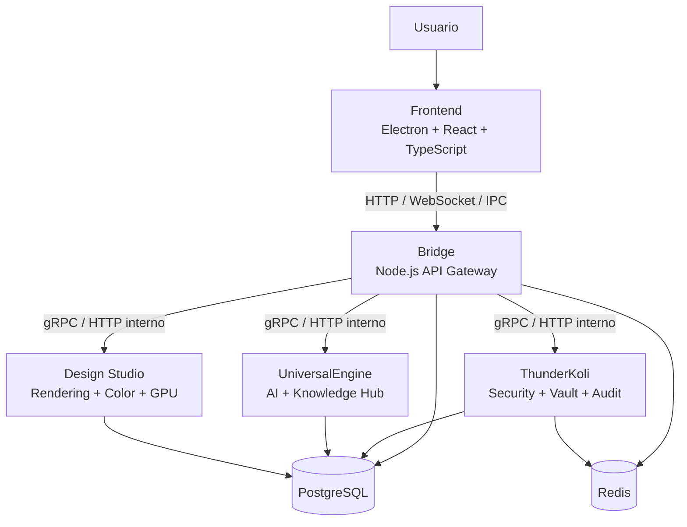
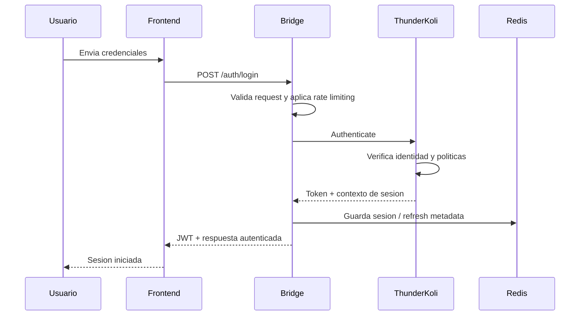
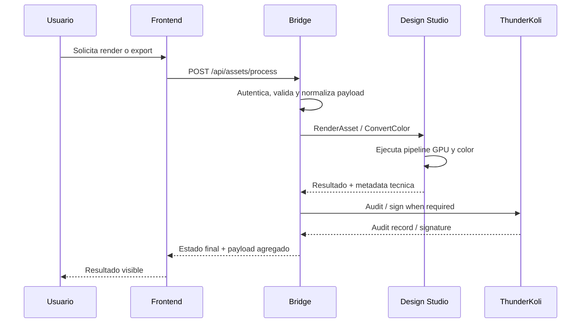
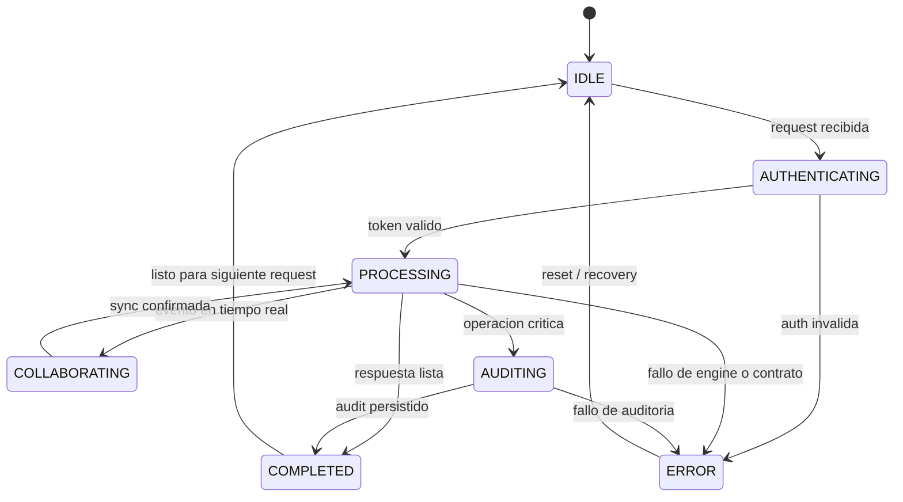

# Architecture Diagrams - KoliCode

Este directorio centraliza diagramas visuales para complementar `docs/ARCHITECTURE.md` y `docs/INTEGRATION_CONTRACTS.md`.

## Component Diagram

## Authentication Sequence

## Render / Asset Processing Sequence

## Bridge State Machine

## Uso recomendado

1. Mantener estos diagramas alineados con cambios en rutas, contratos o modulos.
2. Referenciar este directorio desde README y documentacion de arquitectura.
3. Extender con diagramas de error handling, retries y versionado cuando esos contratos se formalicen.
